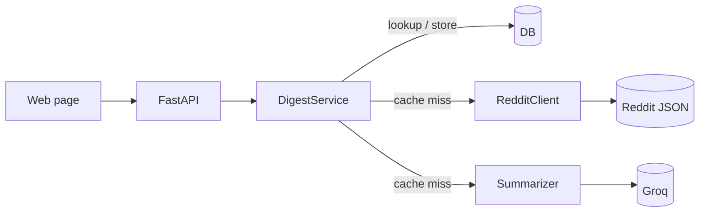

# Sintesi

Type a topic and get today's public consensus from the matching subreddit — a short summary of what
people are actually discussing, the hot themes, and the top posts behind it.

It fetches a subreddit's top posts of the day from Reddit's public JSON, has an LLM write the
consensus, and caches the result so the same topic costs nothing for the rest of the day.

## Architecture



`routes → DigestService → (RedditClient, Summarizer, DB)`. The service orchestrates; the external
clients are thin and swappable, so the suite runs offline with both mocked.

## Stack

Python 3.13 · FastAPI · SQLModel (SQLite / Postgres) · httpx · Groq · pytest · ruff · uv.

## Run it

```bash
uv sync
cp .env.example .env        # add your GROQ_API_KEY and a Reddit user agent
uv run python -m app.seed   # create tables, load the topics
uv run uvicorn app.main:app --reload
```

Page at `/`, Swagger at `/docs`. Tests: `uv run pytest`.

Or run it against Postgres with Docker:

```bash
docker compose up --build   # set GROQ_API_KEY in .env first
```

## Design decisions

- **Reddit's public JSON, not OAuth** — needs only a User-Agent, so setup is one string. Stricter
  rate limits, which the daily cache makes a non-issue.
- **Cache by `(subreddit, day)`** — the expensive Reddit fetch plus LLM call runs once per
  subreddit per day; every read after is a cheap database lookup.
- **Structured LLM output** — the summarizer asks Groq for JSON and validates it into Pydantic
  models, so a bad response fails loudly instead of leaking into the API.

## License

MIT
