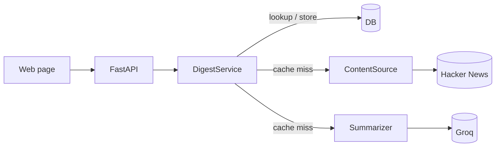

# Sintesi

[](https://github.com/vizzz40/sintesi-ai/actions/workflows/ci.yml)

[Live demo](https://sintesi-ai.onrender.com)

Type a topic and get today's public consensus from Hacker News — a short summary of what people are
actually discussing, the hot themes, and the top posts behind it.

It fetches the top recent stories and comments for a topic from the Hacker News Algolia API, has an
LLM write the consensus, and caches the result so the same topic costs nothing for the rest of the
day. A Reddit source ships too, but Reddit 403s datacenter IPs, so it only works from a residential
network — pick the source with `CONTENT_SOURCE` (`hackernews` or `reddit`).

## Architecture



`routes → DigestService → (ContentSource, Summarizer, DB)`. The service orchestrates; the source is
chosen by config behind a small Protocol, so swapping Hacker News for Reddit is one env var and the
suite runs offline with everything mocked.

## Stack

Python 3.13 · FastAPI · SQLModel (SQLite / Postgres) · httpx · Groq · pytest · ruff · uv.

## Run it

You need Python 3.13, [uv](https://docs.astral.sh/uv/), and a Groq API key.

```bash
uv sync
cp .env.example .env
uv run python -m app.seed
uv run uvicorn app.main:app --reload
```

Add your `GROQ_API_KEY` to `.env`. The page is at `/` and Swagger is at `/docs`.

```bash
uv run pytest
uv run ruff check .
uv run ruff format --check .
```

Or run it against Postgres with Docker:

```bash
docker compose up --build   # set GROQ_API_KEY in .env first
```

## Deploy on Render

[](https://render.com/deploy?repo=https://github.com/vizzz40/sintesi-ai)

The included `render.yaml` creates a free Docker web service, checks `/healthz`, and redeploys the app
after each push to `main`. Open the button, connect the repository, add `GROQ_API_KEY`, and deploy.

The SQLite database is only a daily response cache, so ephemeral storage is enough for this demo.
Free Render services sleep when idle and can take about a minute to wake up.

## Design decisions

- **Hacker News over Reddit** — Reddit blocks datacenter IPs with 403s regardless of User-Agent, so
  it can't run on a cloud host. The HN Algolia API needs no auth and serves datacenter IPs, so
  the live demo actually works. Reddit stays as a selectable source for local use.
- **Cache by `(query, day)`** — the expensive source fetch plus LLM call runs once per topic per
  day; every read after is a cheap database lookup.
- **Structured LLM output** — Groq follows a strict JSON schema and Pydantic validates the result
  before it reaches the API.

## License

MIT
