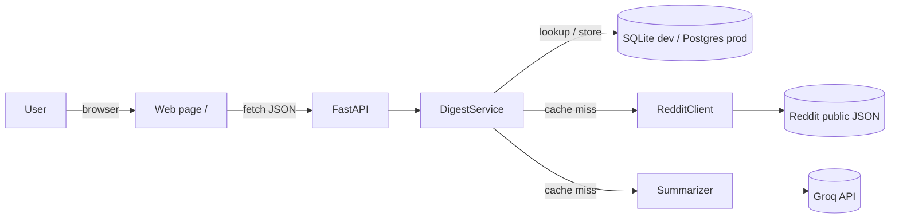
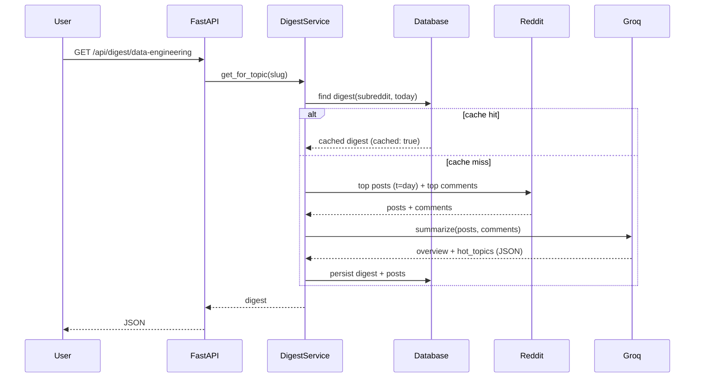
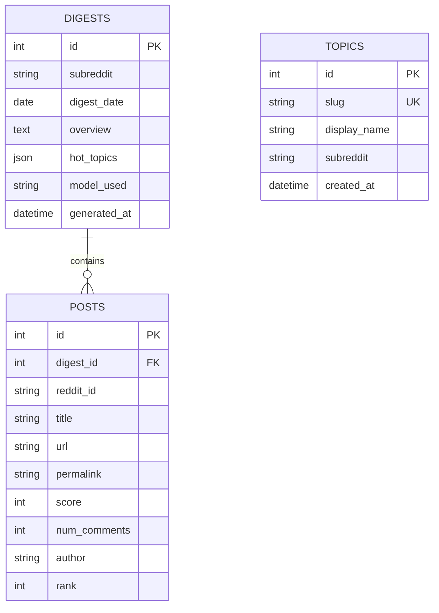

# Sintesi

Type a topic and get today's public consensus from the matching subreddit — a short summary of what
people are actually discussing, the hot themes, and the top posts behind it.

It pulls a subreddit's top posts of the day from Reddit's public JSON, has an LLM write the
consensus, and caches the result so the same topic costs nothing for the rest of the day.

## Features

- Curated topic chips (Data Engineering, DevOps, Polimi, Machine Learning, Python, Web Dev).
- LLM-written **overview** plus 3–5 **hot topics**, with the **top posts** as sources.
- One digest per subreddit per day, cached in the database. `?refresh=true` forces a regenerate.
- REST API with auto Swagger docs, plus a minimal web page (no build step).
- External calls (Reddit, the LLM) sit behind small service classes, so the whole thing tests
  without network access or API keys.

## Architecture



The layering is `routes → DigestService → (RedditClient, Summarizer, models/DB)`. The service
orchestrates; the clients are thin and swappable.

## How it works

A request either hits the day's cached digest or builds a new one.



## Database schema

The cache key is `(subreddit, digest_date)`, so every topic that points at the same subreddit
shares one summary per day. `posts` is a child of `digests`; `hot_topics` is a small JSON list.



- **`topics`** — the curated chips. `slug` is the URL-safe id; `subreddit` is the explicit mapping
  (e.g. `polimi → Polimi`).
- **`digests`** — the cache. Unique on `(subreddit, digest_date)`, indexed on `subreddit`.
  `hot_topics` is JSON `[{title, summary}]`; `model_used` records which model wrote it.
- **`posts`** — the top posts captured for a digest, used for display and as sources. `rank`
  preserves ordering.

## Tech stack

Python 3.13 · FastAPI · SQLModel (SQLite locally, Postgres in prod) · httpx · Groq ·
pydantic-settings · pytest + respx · ruff. Managed with [uv](https://docs.astral.sh/uv/).

## Getting started

```bash
uv sync
cp .env.example .env        # then fill in the values
uv run python -m app.seed   # create tables and load the curated topics
uv run uvicorn app.main:app --reload
```

Open http://127.0.0.1:8000/ for the page, or http://127.0.0.1:8000/docs for Swagger.

You need:
- A **Groq API key** from https://console.groq.com (free tier is plenty for this).
- A **Reddit user agent** string. Reddit's public JSON has no login, but it expects a unique,
  descriptive User-Agent — e.g. `sintesi/0.1 by u/yourusername`.

## API

| Method | Path | Purpose |
|---|---|---|
| `GET` | `/api/topics` | List the curated topics |
| `GET` | `/api/digest/{slug}` | Digest for a topic. `?refresh=true` forces a regenerate |
| `GET` | `/healthz` | Liveness check |
| `GET` | `/` | The web page |
| `GET` | `/docs` | Swagger UI |

`GET /api/digest/{slug}` returns:

```json
{
  "topic": "data-engineering",
  "subreddit": "dataengineering",
  "date": "2026-05-31",
  "overview": "…",
  "hot_topics": [{ "title": "…", "summary": "…" }],
  "top_posts": [
    { "title": "…", "url": "…", "permalink": "…", "score": 420, "num_comments": 37 }
  ],
  "model_used": "llama-3.3-70b-versatile",
  "generated_at": "2026-05-31T09:12:00Z",
  "cached": false
}
```

## Configuration

All config comes from the environment (or a `.env` file).

| Variable | Default | Notes |
|---|---|---|
| `REDDIT_USER_AGENT` | `sintesi/0.1 (personal portfolio project)` | Sent on every Reddit request |
| `REDDIT_BASE_URL` | `https://www.reddit.com` | |
| `GROQ_API_KEY` | _(empty)_ | Required to generate a digest |
| `GROQ_MODEL` | `llama-3.3-70b-versatile` | |
| `DATABASE_URL` | `sqlite:///./sintesi.db` | Use a Postgres URL in prod |
| `POSTS_PER_DIGEST` | `15` | Top posts fetched per day |
| `COMMENTS_PER_POST` | `8` | Top comments pulled per post |

## Tests

```bash
uv run pytest
uv run ruff check
```

Reddit and Groq are mocked, so the suite runs offline and without keys. It covers parsing, the
summarizer's structured output, and the cache hit/miss/refresh paths through the API.

## Design decisions

- **Reddit's public JSON, not OAuth.** The hosted endpoints (`/r/{sub}/top.json`) need only a
  User-Agent, which keeps setup to one string instead of a registered app. The trade-off is
  stricter rate limits — which the daily cache makes a non-issue, since a given subreddit is fetched
  at most once a day.
- **Cache by `(subreddit, day)`.** The expensive part (a Reddit fetch plus an LLM call) runs once
  per subreddit per day; everything after is a cheap database read. This is the core of the project.
- **Synchronous code.** The workload is low-volume and mostly served from cache, so plain `def`
  handlers with `httpx.Client` and sync sessions are simpler and easier to reason about than async
  here. Easy to revisit if traffic ever justified it.
- **Structured LLM output.** The summarizer asks Groq for JSON and validates it into Pydantic
  models, so a malformed response fails loudly instead of leaking into the API.

## Roadmap

- Alembic migrations (currently tables are created on startup).
- Docker + a live deployment with Postgres.
- Ad-hoc search for any subreddit, not just the curated chips.
- A scheduler to pre-warm the curated topics so the first load of the day is instant.
- Search logging and a small analytics view.

## License

MIT
