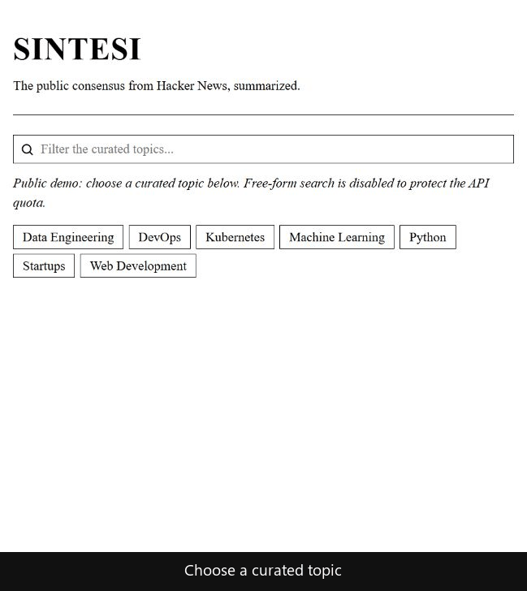
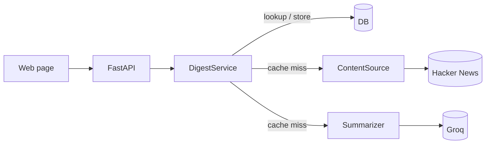

# Sintesi

[](https://github.com/vizzz40/sintesi-ai/actions/workflows/ci.yml)

[Live demo](https://sintesi-ai.onrender.com)

Choose a curated topic and get a daily Hacker News consensus digest — a short summary of what people
are discussing, the hot themes, and the top posts behind it.

It fetches recent stories and comments from the Hacker News Algolia API, asks an LLM to summarize
them, and caches one digest per query and server date. The public demo limits visitors to curated
topics so they cannot use arbitrary searches to consume the owner's Groq quota.

## Demo

[](https://sintesi-ai.onrender.com)

## Architecture



`routes → DigestService → (ContentSource, Summarizer, DB)`. The service orchestrates, and Hacker News
sits behind a small Protocol so another source can be added without changing `DigestService`. The
test suite runs offline with network and LLM calls mocked.

## Stack

Python 3.13 · FastAPI · SQLModel (SQLite / Postgres) · httpx · Groq · pytest · ruff · uv.

## Run it

You need Python 3.13, [uv](https://docs.astral.sh/uv/), and a Groq API key.

```bash
uv sync
cp .env.example .env
uv run python -m app.seed
uv run uvicorn app.main:app --reload
```

Add your `GROQ_API_KEY` to `.env`. The page is at `/` and Swagger is at `/docs`.

```bash
uv run pytest
uv run ruff check .
uv run ruff format --check .
```

Or run it against Postgres with Docker:

```bash
docker compose up --build   # set GROQ_API_KEY in .env first
```

## Deploy on Render

[](https://render.com/deploy?repo=https://github.com/vizzz40/sintesi-ai)

The included `render.yaml` creates a free Docker web service, checks `/healthz`, and redeploys the app
after each push to `main`. Open the button, connect the repository, add `GROQ_API_KEY`, and deploy.

The SQLite database is only a daily response cache, so ephemeral storage is enough for this demo.
Free Render services sleep when idle and can take about a minute to wake up.

## Design decisions

- **Hacker News as the source** — the Algolia API needs no authentication and works from cloud hosts,
  which keeps the demo simple to run and deploy.
- **Cache by `(query, date)`** — the expensive source fetch plus LLM call runs once per topic per
  server date; every read after is a cheap database lookup.
- **Structured LLM output** — Groq follows a strict JSON schema and Pydantic validates the result
  before it reaches the API.

## License

MIT
