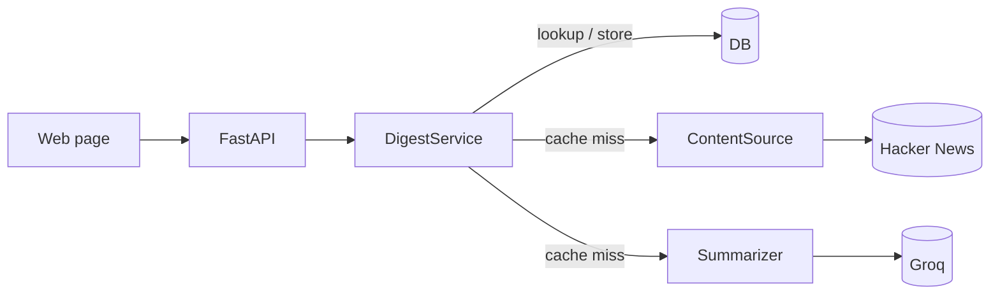

# Sintesi (built with the help of Claude Code)

Type a topic and get today's public consensus from Hacker News — a short summary of what people are
actually discussing, the hot themes, and the top posts behind it.

It fetches the top recent stories and comments for a topic from the Hacker News Algolia API, has an
LLM write the consensus, and caches the result so the same topic costs nothing for the rest of the
day. A Reddit source ships too, but Reddit 403s datacenter IPs, so it only works from a residential
network — pick the source with `CONTENT_SOURCE` (`hackernews` or `reddit`).

## Architecture



`routes → DigestService → (ContentSource, Summarizer, DB)`. The service orchestrates; the source is
chosen by config behind a small Protocol, so swapping Hacker News for Reddit is one env var and the
suite runs offline with everything mocked.

## Stack

Python 3.13 · FastAPI · SQLModel (SQLite / Postgres) · httpx · Groq · pytest · ruff · uv.

## Run it

```bash
uv sync
cp .env.example .env        # add your GROQ_API_KEY
uv run python -m app.seed   # create tables, load the topics
uv run uvicorn app.main:app --reload
```

Page at `/`, Swagger at `/docs`. Tests: `uv run pytest`.

Or run it against Postgres with Docker:

```bash
docker compose up --build   # set GROQ_API_KEY in .env first
```

## Deploy on Koyeb

The included `Dockerfile` can be deployed directly from this GitHub repository:

1. Create a Web Service from the repository and select the Dockerfile builder.
2. Choose the free instance in Frankfurt.
3. Set the health check path to `/healthz`.
4. Add these environment variables:

```text
GROQ_API_KEY=<secret>
CONTENT_SOURCE=hackernews
DATABASE_URL=sqlite:////tmp/sintesi.db
ALLOW_FREEFORM_SEARCH=false
```

The SQLite database is only a daily LLM-response cache, so ephemeral storage is acceptable for the
demo. `ALLOW_FREEFORM_SEARCH=false` keeps the curated topic digests available while preventing
anonymous visitors from consuming the Groq quota with arbitrary queries.

## Design decisions

- **Hacker News over Reddit** — Reddit blocks datacenter IPs with 403s regardless of User-Agent, so
  it can't run on a host like Render. The HN Algolia API needs no auth and serves datacenter IPs, so
  the live demo actually works. Reddit stays as a selectable source for local use.
- **Cache by `(query, day)`** — the expensive source fetch plus LLM call runs once per topic per
  day; every read after is a cheap database lookup.
- **Structured LLM output** — the summarizer asks Groq for JSON and validates it into Pydantic
  models, so a bad response fails loudly instead of leaking into the API.

## License

MIT
